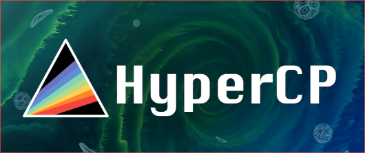
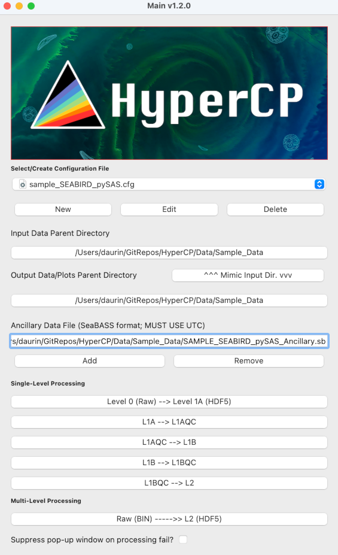
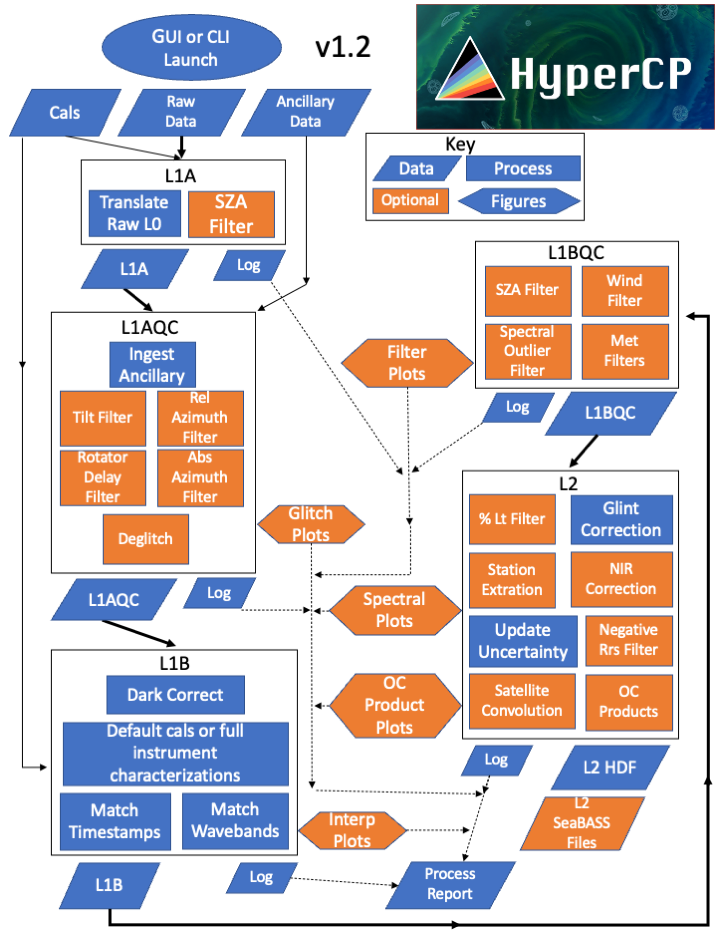

# HyperInSPACE Community Processor (HyperCP)
<html lang="en">


<center></center>


Hyperspectral In situ Support for PACE (HyperInSPACE) Community Processor (HyperCP) is designed to provide hyperspectral support for the <a href='https://pace.gsfc.nasa.gov/'>PACE mission</a> but also multispectral missions such as
[Sentinel-3](https://sentinels.copernicus.eu/web/sentinel/missions/sentinel-3) by processing automated and manual, above-water,
hyperspectral ocean color radiometry data using state-of-the-art methods and protocols for quality assurance,
uncertainty estimation/propagation, sky/sunglint correction, convolution to satellite wavebands, and ocean color product
retrieval. Data outputs are formatted to text files for submission to the [SeaBASS](https://seabass.gsfc.nasa.gov/) and [OCDB](https://ocdb.eumetsat.int/) databases and saved as comprehensive HDF5 records with automated processing reports. The package is designed to facilitate rigorous, flexible, and transparent data processing for the ocean color remote sensing community. Radiometry processed in HyperCP is used for water optical characterization, ocean color product retrieval algorithm development, and orbital platform validation.

Currently, HyperCP supports <a href='https://www.seabird.com/'>Sea-Bird Scientific</a> HyperSAS packages with and
without SolarTracker or pySAS robotic platforms as well as [TriOS](https://www.trios.de/en/radiometers.html) used in manual configuration. If you are interested in integrating support for your platform, contact us at the email addresses below or in the Discussions tab of the GitHub repository.

## Version 1.2.10

```
The MIT license

 Copyright © 2020 United States Government as represented by the Administrator of the National Aeronautics and Space Administration. All Rights Reserved.

 Copyright © 2023 EUMETSAT

Permission is hereby granted, free of charge, to any person obtaining a copy of this software and associated documentation files (the "Software"), to deal in the Software without restriction, including without limitation the rights to use, copy, modify, merge, publish, distribute, sublicense, and/or sell copies of the Software, and to permit persons to whom the Software is furnished to do so, subject to the following conditions:

The above copyright notice and this permission notice shall be included in all copies or substantial portions of the Software.

THE SOFTWARE IS PROVIDED "AS IS", WITHOUT WARRANTY OF ANY KIND, EXPRESS OR IMPLIED, INCLUDING BUT NOT LIMITED TO THE WARRANTIES OF MERCHANTABILITY, FITNESS FOR A PARTICULAR PURPOSE AND NONINFRINGEMENT. IN NO EVENT SHALL THE AUTHORS OR COPYRIGHT HOLDERS BE LIABLE FOR ANY CLAIM, DAMAGES OR OTHER LIABILITY, WHETHER IN AN ACTION OF CONTRACT, TORT OR OTHERWISE, ARISING FROM, OUT OF OR IN CONNECTION WITH THE SOFTWARE OR THE USE OR OTHER DEALINGS IN THE SOFTWARE.
 ```

**Main author**: Dirk Aurin, MSU @ NASA Goddard Space Flight Center <dirk.a.aurin@nasa.gov>

**Co-authors**: Nathan Vandenberg @ UVictoria, Maycira Costa @ UVictoria (in the frame of [PySciDON](https://ieeexplore.ieee.org/abstract/document/8121926)), Alexis Deru @ ACRI-ST, Ashley Ramsay @ NPL, Agnieszka Bialek @ NPL, Marine Bretagnon @ ACRI-ST (in the frame of Copernicus' [FRM4SOC-2](https://frm4soc2.eumetsat.int/)), Gabriele Bai @ ACRI-ST, Juan Ignacio Gossn @ EUMETSAT, Nils Haentjens @ UMaine

**Contact**: Discussions tab in GitHub, or Dirk Aurin, MSU @ NASA Goddard Space Flight Center <dirk.a.aurin@nasa.gov>, and Juan Ignacio Gossn @ EUMETSAT <JuanIgnacio.Gossn@eumetsat.int>

## Contents:
### [Requirements and Installation](#requirements-and-installation)
### [Launch the Program](#3-launch-hypercp-for-the-first-time)
### [Quick Start Guide](#quick-start-overview)
### [Main Window](#main-window-description)
### [Configuration Window (README_configuration.md)](README_configuration.md)


## Requirements and Installation

### 1. Get the HyperCP repository

Clone this repository (branch: "master") to a convenient directory on your computer:

```
prompt$ git clone --depth 1 https://github.com/nasa/HyperCP.git /path/to/convenient/directory
```

If you are, or plan to be, a HyperCP Team collaborator, or if you are interested in early release branches, drop '--depth 1' from the clone command. If you are unfamiliar with git or having difficulty with the anaconda environment, [bundled releases](https://github.com/nasa/HyperCP/releases) are available for Mac, Windows, and Linux. Go to the latest release (named for the Version above) and under Assets download and unzip the version for your operating system.

### 2. Get the HyperCP environment

HyperCP requires Python 3.X installed on a Linux, MacOS, or Windows computer.
The <a href='https://www.anaconda.com/'>Anaconda</a> distribution
(or <a href='https://docs.conda.io/en/latest/miniconda.html'>Miniconda</a>) is encouraged.
If you are unfamiliar with Anaconda, a nice walkthrough can be found [here](https://youtu.be/YJC6ldI3hWk).

All of the package dependencies are listed in the environment.yml file included with the package. To make sure you have
all of the necessary dependencies, navigate to the HyperCP directory on command line, type:

```
prompt$ conda env create -f environment.yml
```

and follow the prompts to install the additional package dependencies on your machine within the new virtual environment.
When completed you should be in the virtual environment: the prefix ```(hypercp)``` before your prompt should appear
indicating that the system is properly enabled and ready to run from the terminal.

To return to the environment later before launching the program, type

```
prompt$ conda activate hypercp
```

To stay up to date with the latest commits to the master branch, it is strongly recommended that you pull them prior to
using the software. From the HyperCP directory, type:

```
(hypercp) prompt$ git pull
```

[If, instead, you are not using git you should regularly re-download and unzip the repository or the bundled executable version to ensure you are using the latest version of the software].

If environment problems are encountered after updating HyperCP (e.g, dependencies are not found), try updating the environment (after activating hypercp) using:

```
conda env update --file environment.yml --prune
```
**NOTE:** If you started with working with v1.2.8 or less and are now in v1.2.9 or higher, you may need to remove the old hypercp environment and reinstall the environment as described above.
```
prompt$ conda deactivate
prompt$ conda remove -n hypercp --all
```

To report a bug, please submit it [here](https://github.com/nasa/HyperCP/issues), the HyperCP Team will take
care of it :). All other support inquiries should be directed to the Discussions board [here](https://github.com/nasa/HyperCP/discussions)

### 3. Launch HyperCP for the first time!

To finalize and test the set-up, let's launch HyperCP for the first time: navigate to the project folder on
the command line and type:

```
(hypercp) prompt$ python Main.py
```

A GUI window should pop up, looking approximately like this:

<center></center>

When HyperCP/Main.py is launched for the first time, sub-directories will be created and databases downloaded and moved
into them as described below. No system files will be changed.

#### 3.1 Directories (created after first launch)

- **Config**: Configuration and instrument files (by subdirectory - auto-created), SeaBASS header configuration files,
        main view configuration file.
- **Logs**: Most command line output messages generated during processing are captured for later reference in .log text
        files here.
- **Plots**: A variety of optional plotting routines are included which create sub-directories
        (i.e. 'L1AQC_Anoms', 'L1B_Interp', 'L2_Spectral_Filter', 'L2', 'L2_Products').
- **Data**: This directory now comes unpacked in the distribution. By default, it contains only
        files for seawater absorption properties, top-of-atmosphere solar irradiance,
        satellite sensor spectral response functions, banner images for the GUI,
        and the Zhang glint correction database (see Database Download below).
        This is also the optional fallback location for input and/or output radiometry data,
        though using separate locations for field data is recommended.
- **Source**: This directory (which comes unpacked with the distribution) holds the majority of the Python source code.

#### 3.2 Database (downloaded after first launch)

- **Zhang skyglint correction database**: This (~ 2.3 GB) database will be optionally used for the glint correction
based on the method of [Zhang et al., 2017, OE, 25(4)](https://opg.optica.org/oe/fulltext.cfm?uri=oe-25-4-A1&id=357012)).
It will stored at ```/Data/Zhang_rho_db.mat```.
If this download should fail for any reason, further instructions will be given
at the command line terminal where Main.py was launched.

## Usage

If you followed [Requirements and Installation](README.md/#requirements-and-installation) successfully, you are ready
to start using HyperCP!

<center></center>

### Quick Start Overview

1. Identify the research cruise, relevant calibration files, and ancillary data files to be used in processing.
2. Launch HyperCP and set up the Main Window for data directories and the ancillary file
3. Create a new Configuration (or edit an existing Configuration)
4. Add and enable only *relevant* calibration and instrument files to the Configuration; there is no such thing as a standard instrument package
5. Choose appropriate processing parameters for L1A-L2 (do not depend on software defaults; there is no such thing as a standard data collection)
6. HDF5 files will be produced at each level of processing, plus optional SeaBASS text files for radiometry at L2. Plots can be produced at L1AQC, L1B, and L2. Processing logs and plots are aggregated into optional PDF Reports at L2 (covering all processing from RAW to L2) written to a dedicated Reports directory in the selected Output directory.


### Main Window: Description

HyperCP is a Main-View-Controller Python package with a GUI that can be launched in several ways.
However you launch the GUI, *watch for important feedback at the command line terminal* in addition to informational GUI windows.
Batching multiple files across single or multiple processing levels is also possible
as described below.

<!-- To see an example of a complete workflow of the processing from raw data to the final HDF and SeaBASS/OCDB L2 outputs,
both for TriOS and HyperSAS,
please see [here](https://gitlab.eumetsat.int/OC/External/frm4soc-cp/-/blob/master/Command_line_example.cmd) <- firewalled -->


The Main window appears once Main.py is launched, as described [above](README.md/#3-launch-hypercp-for-the-first-time):

 ```
(hypercp) prompt$ python Main.py
```

 The GUI's main window is divided into four main sections, each with options to specify:

 1. A configuration file
 2. Input/output directories
 3. Ancillary input files
 4. Single-level processing
 5. Multi-level processing

Pop-up windows for failed processing (i.e, no output data due to either corrupt raw data or stringent quality control filtering) files can be suppressed using the check box. No output file at a given processing level is often a normal result of quality control filtering, so checking this box allows batches to continue uninterrupted (or frees the core if multi-core processing via command line).

 NB: Your Main window set up (including configuration file, Input/Output directories, and Ancillary File) will be saved automatically in
 Config/main.config and reopened the next time you launch Main.py.


#### 1. Configuration Section

The configuration section in the Main window involves setting the correct config (.cfg) file, which in turn includes
 details of which processing parameters and calibration/characterisation files will be used to run HyperCP.

You will need to read the [Configuration README](README_configuration.md) to learn how to set your configuration file appropriately.

1. The 'New' button allows creation of a new configuration file.
2. 'Edit' allows editing the currently selected configuration file.
3. 'Delete' is used to delete the currently selected configuration file *and* corresponding auto-created
calibration directories.

 After creating a new configuration file, select it from the drop-down menu, and select 'Edit' to launch the
 **Configuration module** GUI.

#### 2. Input/Output Directories

It will be helpful to set your 'Input Data' and 'Output Data' directories from the Main window. As an example, one could
 use a cruise directory containing RAW HyperSAS data as the Input Parent Directory, and then create another directory to
 use as the Output Parent Directory when processing from L0 (raw binary). Inside the Output Parent Directory, files will
 be automatically sorted by processing level in the automatically created sub-directories (i.e. the software
 automatically creates and looks for L1A, L1AQC, L1B, L1BQC, and L2 directories under the parent directory). If not
 selected, the Input/Output parent directories will default to the /Data directory within HyperCP.

The 'Input...' and 'Output Data/Plots Parent Directory' buttons are self explanatory and allow optional selection of data
and directories from any mounted/mapped drive. Note that output data and plot sub-directories (e.g. for processing levels)
are also auto-created during processing as described below. The parent directory is the directory containing the
sub-directories for processing levels (e.g. "/L1A", "/L1B", etc.) If no input or output data directories are selected,
'/Data' and '/Plots' under the HyperCP directory structure will be used by default as the parent directories.

#### 3. Ancillary Input Files

Ancillary data files for environmental conditions and relevant geometries used in processing must be text files in
SeaBASS format with columns for date, time, lat, and lon. For a description of the SeaBASS format see
[this](https://seabass.gsfc.nasa.gov/).

Optional data fields in the SeaBASS format include

- station number,
- ship heading,
- ship speed,
- relative sensor azimuth,
- aerosol optical depth,
- cloud cover,
- salinity,
- water temperature,
- wind speed.

Example ancillary files are included in /Data/Sample_Data for use as a template. It is recommended that ancillary files are checked with the ```FCHECK``` utility as described [here](https://seabass.gsfc.nasa.gov/wiki/FCHECK). They will be interpreted using the included ```SB_support.py``` module from NASA/OBPG.

In case environmental conditions were not logged in the field, or for filling in gaps in logged data, they will be
retrieved from GMAO or ECMWF models as described below. The ancillary data file is optional (though strongly advised for adding wind speed at a minimum) provided the sensor suite is equipped with a SolarTracker, pySAS, or equivalent to supply the relevant sensor/solar geometries combined with a GPS for position and time. If no SolarTracker-type instrument is present to report the relative sensor/solar geometries, the ancillary file must be provided with at least the ship heading and relative angle between the bow of the ship and the sensor azimuth as a function of time (see sample "NOTRACKER" configuration provided). If no GPS is present, position and time are also required in an ancillary file. Application of the Zhang et al. (2017) glint correction will require the addition of GMAO or ECMWF model data for aerosol optical depth.

**The relative azimuth convention adopted in HyperCP (and expected in ancillary inputs) defines relAz as the angle between the sensor viewing angle (from the sensor to the target) and the solar azimuth angle (from the sensor to the sun). Certain modules in HyperCP, including the Zhang et al. 2017 glint correction and the Morel 2002 BRDF correction use 180 - relAz.**


#### 4. Single-level Processing

HyperCP's workflow follows processing levels from L0 to L2, resembling satellite processing levels.
In this section you can execute each of the processors that take you from one processing level to the next individually.

A file selection dialogue will appear. Multiple data files can be processed together (successively) by simply selecting
them together in the GUI  (e.g. ```Shift-``` or ```Ctrl-``` click, or ```Ctrl-A``` for all, depending on your platform).
Input files will be checked for matching expected input level (e.g. L1AQC file input for for L1B processing will raise an error).

#### 5. Multi-level Processing


Multi-level processing works the same as  single-level by processing each input raw file through all levels before moving
on to the next raw file. However, it  will only continue with a given file if the preceding level was created immediately
(within 1 minute) prior. In other words, if -- due to changes in QA/QC parameterization -- a file is entirely discarded
at a given level, but an old file of the same name still exists in that directory, it will be ignored, and processing
for that file will be terminated for higher levels.

### Processing workflow overview
<center></center>

Level 1A through Level 2 processing configurations are adjusted in the Configuration window.
If you are reading this for the first time, opening the Configuration Window is a good reference to accompany the
discussion [here](README_configuration.md) regarding processing.

- Level 1A Processing: Process data from raw binary (Satlantic HyperSAS '.RAW' collections) to L1A (Hierarchical Data Format 5 '.hdf').
Calibration files and the RawFileReader.py script allow for interpretation of raw data fields, which are read into HDF
objects.
- Level 1AQC Processing: Data are filtered for vessel attitude (pitch, roll, and yaw when available), viewing
and solar geometry.
- Level 1B Processing: Dark current corrections are applied followed by instrument calibrations and then matching of timestamps and wavebands
for all radiometers in the suite.
- Level 1BQC Processing: Further quality control filters are applied to data prior to L2 ensemble binning and reflectance
calculation.
- Level 2 Processing: Data are averaged within optional time interval ensembles prior to calculating the remote sensing
reflectance within each ensemble.

### Executing HyperCP from the command line

There are a couple of way HyperCP can be run without the GUI. The first is to make a scripted call to the Command class in the Main.py file. This is demonstrated with the [run_Sample_Data.py](run_Sample_Data.py) script provided in the top level of the repository. By copying this file and customizing it for your data (e.g., changing file paths to make your directories), and editing the processing configuration (either in the GUI or manually editting the relevant ./Config/your_Configuration.cfg file) you can use a direct python call to the script to run HyperCP. As demonstrated in the sample script, it can be run for multiple levels and can use multiple core threads to speed up processing.

There is also a command line option for batching a single level which can be triggered by adding the ```-cmd``` argument:

```
(hypercp) prompt$ python Main.py -c config -i inputFile -o outputDirectory -l processingLevel
```

where ```config``` is the configuration file, and the other arguments are self-explanatory
(```processingLevel``` should be in all caps, e.g., ```L1AQC```).

## References
- Abe, N., B. Zadrozny and J. Langford (2006). Outlier detection by active learning. Proceedings of the 12th ACM SIGKDD international conference on Knowledge discovery and data mining. Philadelphia, PA, USA, Association for Computing Machinery: 504–509.
- Brewin, R. J. W., G. Dall'Olmo, S. Pardo, V. van Dongen-Vogels and E. S. Boss (2016). "Underway spectrophotometry along the Atlantic Meridional Transect reveals high performance in satellite chlorophyll retrievals." Remote Sensing of Environment 183: 82-97.
- Burggraaff, O. (2020). "Biases from incorrect reflectance convolution." Optics Express 28(9): 13801-13816.
- Chandola, V., A. Banerjee and V. Kumar (2009). "Anomaly detection: A survey." ACM Comput. Surv. 41(3): Article 15.
- Coddington, O. M., Richard, E. C., Harber, D., Pilewskie, P., Woods, T. N., Chance, K., et al. (2021). The TSIS-1 Hybrid Solar Reference Spectrum. Geophysical Research Letters, 48, e2020GL091709. https://doi.org/10.1029/2020GL091709
- D’Alimonte, D. and T. Kajiyama (2016). "Effects of light polarization and waves slope statistics on the reflectance factor of the sea surface." Optics Express 24(8): 7922-7942.
- Foster, R. and A. Gilerson (2016). "Polarized transfer functions of the ocean surface for above-surface determination of the vector submarine light field." Applied Optics 55(33): 9476-9494.
- Garaba, S. P., J. Schulz, M. R. Wernand and O. Zielinski (2012). "Sunglint Detection for Unmanned and Automated Platforms." Sensors 12(9): 12545.
- Gilerson, A., C. Carrizo, R. Foster and T. Harmel (2018). "Variability of the reflectance coefficient of skylight from the ocean surface and its implications to ocean color." Optics Express 26(8): 9615-9633.
- Harmel, T., A. Gilerson, A. Tonizzo, J. Chowdhary, A. Weidemann, R. Arnone and S. Ahmed (2012). "Polarization impacts on the water-leaving radiance retrieval from above-water radiometric measurements." Applied Optics 51(35): 8324-8340.
- Hieronymi, M. (2016). "Polarized reflectance and transmittance distribution functions of the ocean surface." Optics Express 24(14): A1045-A1068.
- Hooker, S. B., G. Lazin, G. Zibordi and S. McLean (2002). "An Evaluation of Above- and In-Water Methods for Determining Water-Leaving Radiances." Journal of Atmospheric and Oceanic Technology 19(4): 486-515.
- Hooker, S. B. and A. Morel (2003). "Platform and Environmental Effects on Above-Water Determinations of Water-Leaving Radiances." Journal of Atmospheric and Oceanic Technology 20(1): 187-205.
- Lee, Z., Y.-H. Ahn, C. Mobley and R. Arnone (2010). "Removal of surface-reflected light for the measurement of remote-sensing reflectance from an above-surface platform." Optics Express 18(25): 26313-26324.
- Mobley, C. D. (1999). "Estimation of the remote-sensing reflectance from above-surface measurements." Applied Optics 38(36): 7442-7455.
- Mobley, C. D. (2015). "Polarized reflectance and transmittance properties of windblown sea surfaces." Applied Optics 54(15): 4828-4849.
- Mueller, J. L., A. Morel, R. Frouin, C. O. Davis, R. Arnone, K. L. Carder, Z. P. Lee, R. G. Steward, S. B. Hooker, C. D. Mobley, S. McLean, B. Holbert, M. Miller, C. Pietras, K. D. Knobelspiesse, G. S. Fargion, J. Porter and K. J. Voss (2003). Ocean Optics Protocols for Satellite Ocean Color Sensor Validation, Revision 4, Volume III. Ocean Optics Protocols for Satellite Ocean Color Sensor Validation. J. L. Mueller. Greenbelt, MD, NASA Goddard Space Flight Center.
- Ruddick, K., V. De Cauwer and B. Van Mol (2005). Use of the near infrared similarity reflectance spectrum for the quality control of remote sensing data, SPIE.
- Ruddick, K. G., V. De Cauwer, Y.-J. Park and G. Moore (2006). "Seaborne measurements of near infrared water-leaving reflectance: The similarity spectrum for turbid waters." Limnology and Oceanography 51(2): 1167-1179.
- Simis, S.G.H., J. Olsson (2013). "Unattended processing of shipborne hyperspectral reflectance measurements." Remote Sensing of Environment, Volume 135.
- Vandenberg, N., M. Costa, Y. Coady and T. Agbaje (2017). PySciDON: A python scientific framework for development of ocean network applications. 2017 IEEE Pacific Rim Conference on Communications, Computers and Signal Processing (PACRIM).
- Wernand, M. R. (2002). GUIDELINES FOR (SHIP BORNE) AUTO-MONITORING
OF COASTAL AND OCEAN COLOR. Ocean Optics XVI. S. Ackleson and C. Trees. Santa Fe, NM, USA.
- Zhang, X., S. He, A. Shabani, P.-W. Zhai and K. Du (2017). "Spectral sea surface reflectance of skylight." Optics Express 25(4): A1-A13.
- Zibordi, G., S. B. Hooker, J. F. Berthon and D. D'Alimonte (2002). "Autonomous Above-Water Radiance Measurements from an Offshore Platform: A Field Assessment Experiment." Journal of Atmospheric and Oceanic Technology 19(5): 808-819.
- Zibordi, G., F. Mélin, J.-F. Berthon, B. Holben, I. Slutsker, D. Giles, D. D’Alimonte, D. Vandemark, H. Feng, G. Schuster, B. E. Fabbri, S. Kaitala and J. Seppälä (2009). "AERONET-OC: A Network for the Validation of Ocean Color Primary Products." Journal of Atmospheric and Oceanic Technology 26(8): 1634-1651.
- Zibordi, G., K. J. Voss, B. Johnson and J. L. Mueller (2019). Protocols for Satellite Ocean Colour Data Validation: In Situ Optical Radiometry. IOCCG Ocean Optics and Biogeochemistry Protocols for Satellite Ocean Colour Sensor Validation. IOCCG. Dartmouth, NS, Canada, IOCCG.