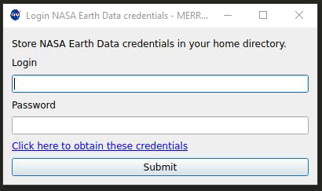
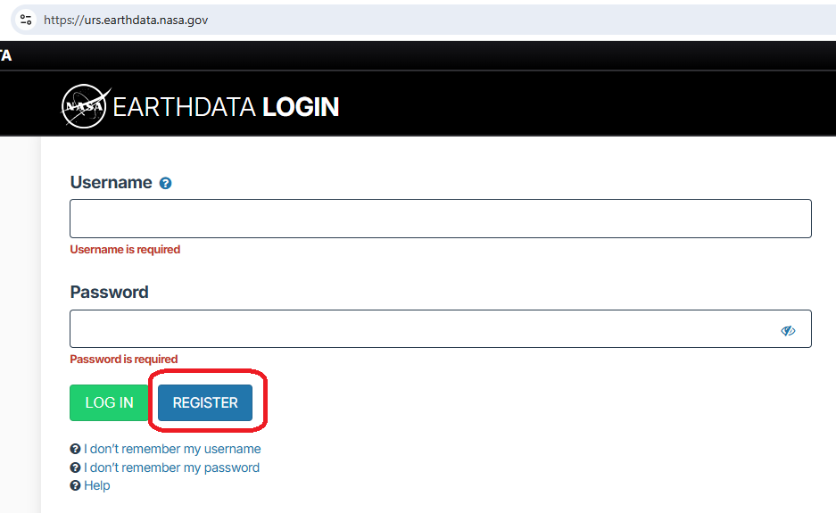
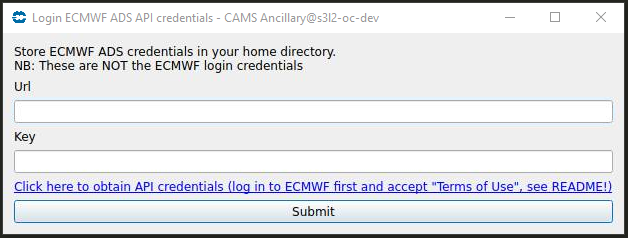
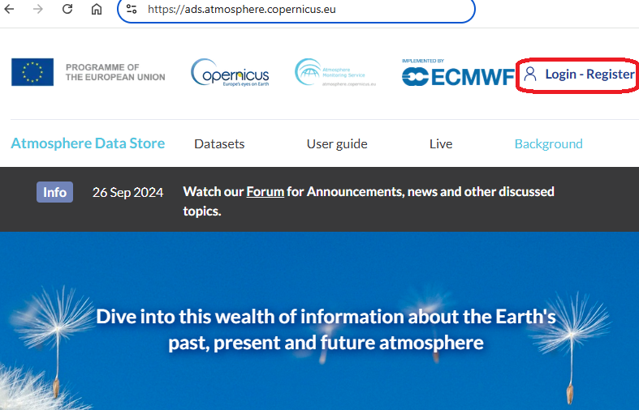
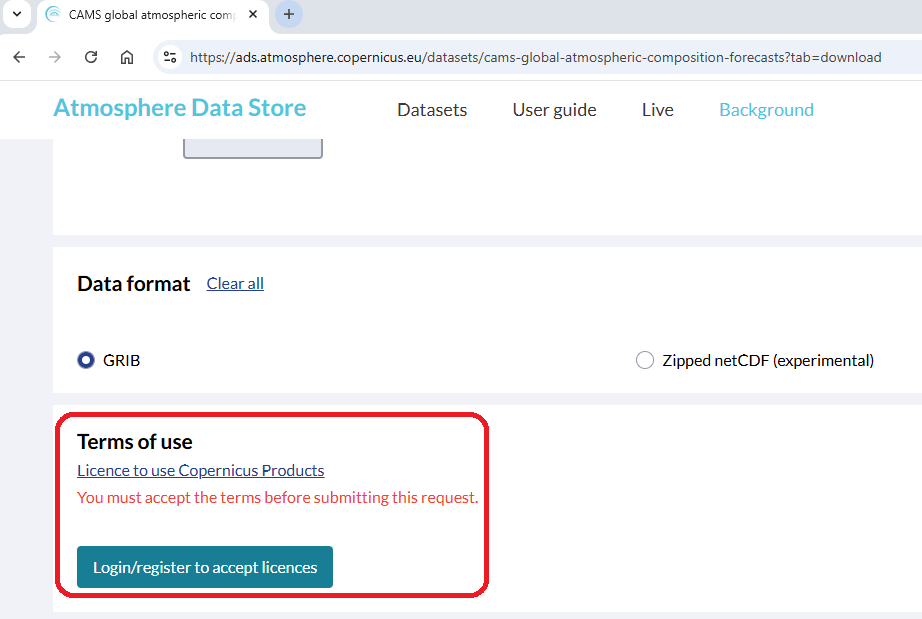

# Ancillary Sources Used in HyperCP: GMAO/MERRA-2 reanalysis and ECMWF/CAMS forecast

HyperCP uses ancillary information such as wind speed, aerosol optical depth, air temperature, salinity, and sea surface temperature 
during the following steps:

- L1BQC processing: QC screening uses wind speed to filter the data for minimizing glint contamination
- L2 processing: ancillary information is also required to calculate the [L2 Sky/Sunglint Correction](README_configuration/#l2-sky-sunglint-correction-rho-and-nir-correction) 
  - Mobley (1999) rho factors require wind speed
  - Zhang et al. 2017 rho factors require wind speed, aerosol optical depth, salinity, and sea surface temperature

Since most field collections of above water radiometry are missing some or all of these ancillary parameters (though 
they can be input in the Ancillary file, if available), an embedded function allows the user to download model data from
two possible sources (to be selected by the user):

- NASA [Global Modeling and Assimilation Office (GMAO)](https://gmao.gsfc.nasa.gov/) data are 
 requested to the NASA EARTHDATA server. GMAO data are generated by the as hourly, 
 global [MERRA2](https://gmao.gsfc.nasa.gov/reanalysis/MERRA-2/) HDF files at 0.5 deg (latitude) by 0.625 deg (longitude) resolution.
 Two files will be downloaded for each hour of data processed (total ~8.3 MB for one hour of field data) and stored in
 /Data/Anc. Global ancillary data files from GMAO will be reused, so it is not recommended to clear this directory unless 
 updated models are being released by GMAO. 
 
        Note: MERRA2 files are not released until some days to weeks after the date in question. Link below for current status.
[MERRA2 processing status](https://gmao.gsfc.nasa.gov/operations/status.php)

        Note: MERRA2 files downloaded prior to March 15, 2022 can be deleted as the file name format has changed
- ECMWF [CAMS global atmospheric composition forecasts](https://ads.atmosphere.copernicus.eu/datasets/cams-global-atmospheric-composition-forecasts?tab=overview)
data are requested to ECMWF via the [ADS API](https://confluence.ecmwf.int/display/CKB/Atmosphere+Data+Store+%28ADS%29+documentation).
One netCDF file at 0.4 degree (lat/lon) is downladed for each hour of processed data (totalling ~ 45K for one hour of
- filed data) and stored in /Data/Anc. Ancillary data files are downloaded only at the 0.4 x 0.4 pixel
cotaining the lat/lon reported for the field acquisition. 

## Obtain the credentials

When either of the two sources is selected in the L1B section of the [Configuration Window](#README_configuration), a 
window will pop-up to insert the required credentials. Please note, that the ancillary source may be selected by default
for a given setup, meaning that the window may pop-up before opening the configuration window for edition.

### GMAO MERRA2 credentials

A pop-up window like this will show up:

<left></left>

Access to GMAO MERRA2 data requires a user login and password, which can be obtained for free
[here](https://urs.earthdata.nasa.gov/):

<left></left>

The login and password will be stored under ```~/.netrc``` (or ```~/_netrc``` for Windows users).

### ECMWF CAMS GACF credentials

A pop-up window like this will show up:

<left></left>

First, you must go [here](https://ads.atmosphere.copernicus.eu/) and register for free:

<left></left>

Once registered and logged in your URL and KEY API credentials should show [here](https://ads.atmosphere.copernicus.eu/how-to-api):

<left></left>

Please insert URL and KEY in the pop-up window. Please note:

- The API URL and KEY that you need to insert in the HyperCP pop-up window are these last ones and are different from your ECMWF credentials!
- This process is agnostic to your operative system (disregard the options shown by ECMWF with respect to this)

Finally *don't forget* to accept the Terms and Conditions scrolling all the way down in the 
[CAMS GACF Download tab](https://ads.atmosphere.copernicus.eu/datasets/cams-global-atmospheric-composition-forecasts?tab=download):

<left></left>

## When should I use MERRA2 and when CAMS?

We *do not* offer a comparison in terms of quality and precision of the two ancillary sources. The user is left
to perform their own independent investigation.

- Global MERRA2 hourly ancillary model data are not available until the calendar month following the model date.
This may lead to a 401 error if you are trying to acquire MERRA2 data within the month being processed. In this situation
the user should switch to using the ECMWF model or the default fall-back values based on best estimates.

- On the other hand, even if ECMWF's CAMS-GACF dataset is a forecast source, temporary downfalls of the ECMWF API may occur.
If your field acquisitions are older than a calendar month, and you are experiencing slow downloads, please consider switching to MERRA-2.

- CAMS data are not available for field acquisitions done before 2015.

## What is the fallback in HyperCP in case ancillary information is missing?

These ancillary data from models will be incorporated if field data are not available in the Ancillary file provided
in the Main window. If field data and model data are both inaccessible for any reason, the system will use the Default
values (i.e., Wind Speed, AOD, Air Temp, Salinity, and SST) provided in the L1B Configuration setup.