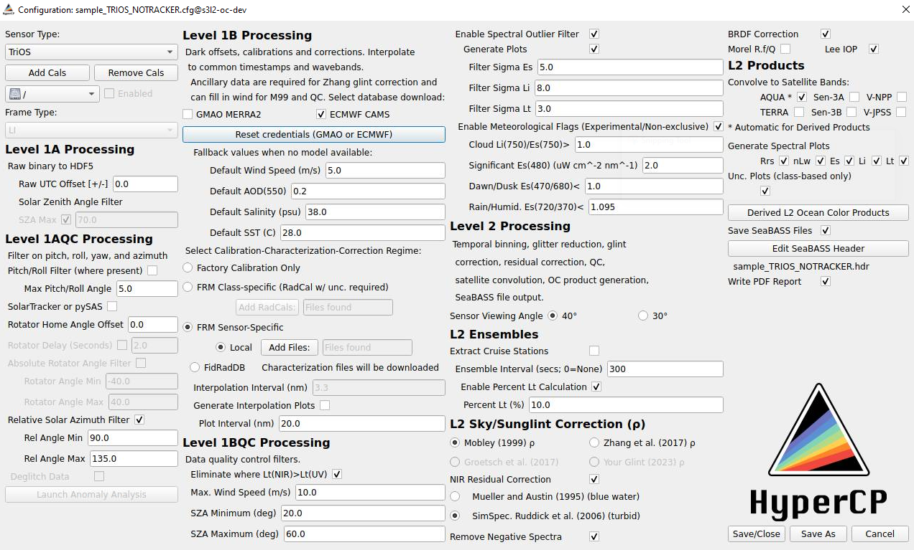

# Configuration

Launch the configuration module and GUI (ConfigWindow.py) from the Main window by selecting/editing a configuration file
 or creating a new one. This file will be instrument-suite-specific, and is also deployment-specific according to which 
 factory calibration files are needed, as well as how the instrument was configured on the platform or ship. 
 Some cruises (e.g. moving between significantly different water types) may also require multiple configurations to 
 obtain the highest quality ocean color products at Level 2. Sharp gradients in environmental conditions could also 
 warrant multiple configurations for the same cruise (e.g. sharp changes in air temperature may effect how data 
 deglitching is parameterized, as described [below]).

The configuration window should look like this:

<center></center>

## Calibration & Instrument Files

***NOTE: IT IS IMPORTANT THAT THESE INSTRUCTIONS FOR SELECTING AND ACTIVATING CALIBRATION AND INSTRUMENT FILES ARE 
FOLLOWED CAREFULLY OR PROCESSING WILL FAIL***

**Note: You do not need to move/copy/paste your calibration and instrument files; HyperCP will take care of that for you.**

In the 'Configuration' window, click 'Add Calibration Files' to add the *relevant* calibration or instrument files 
(date-specific HyperOCR or TriOS factory calibrations or ancillary instrument Telemetry Definition Files; 
e.g. in the case of HyperOCR the '.cal' and '.tdf' files). *Only add and enable those calibration and instrument files 
that are relevant to the cruise/package you wish to process (see below).*

In the case of HyperOCRs, each instrument you add here -- be it a radiometer or an external data instrument such as a 
GPS or tilt-heading sensor -- requires at least one .cal or .tdf file for raw binary data to be interpreted. 
Two .cal files are required in the case of radiometers calibrated seperately for shutter open (light) and shutter closed 
(dark) calibrations, as is typical with Satlantic/Sea-Bird HyperOCRs. Instruments with no calibrations (e.g. GPS, 
SolarTracker, etc.) still require a Telemetry Definition File (.tdf) to be properly interpreted. Compressed archives 
(.sip) containing all the required cal files can also be imported here, and will be unpacked automatically by the 
software to place the calibration and telemetry files into the appropriate Config folder.

In the case of TriOS, 3 files are required per radiometer to provide all the calibration data needed for processing: 
for the device number "xxxx", Cal_xxxx.dat and Back_xxxx_dat, respectively contain the raw calibration factors and 
the background levels, while SAM_xxxx.ini provides initialisation information to the processor.

Adding new files will automatically copy these files from the directory you identify on your machine when prompted by
 pressing ```Add Cals``` into the HyperCP directory structure. You should not need to edit the contents of the 
 ```HyperInSPACE/Config``` directory manually.

The calibration or instrument file is selected using the drop-down menu. Enable (in the neighboring checkbox) only the 
files that correspond to the data you want to process with this configuration. You will need to know which .cal/.tdf 
files correspond to each sensor/instrument, and which represent light and dark shutter measurements. 

For **HyperOCR**:

- **SATMSG.tdf**: SAS Solar Tracker status message string (Frame Type: Not Required)
- **SATTHSUUUUA.tdf**: Tilt-heading sensor (Frame Type: Not Required) ‡
- **SATNAVxxxA.tdf**: SeaBird Solar Tracker (Frame Type: Not Required)
- **UMTWR_v0.tdf**: UMaine Solar Tracker (Frame Type: Not Required)
- **GPRMC_NMEAxxx.tdf**: GPS (Frame Type: Not Required)
- **SATPYR.tdf**: Pyrometer (Frame Type: Not Required)
- **HEDxxxA.cal**: Es (Frame Type: Dark)
- **HSExxxA.cal**: Es (Frame Type: Light)
- **HLDxxxA.cal**: Li (Frame Type: Dark)
- **HSLxxxA.cal**: Li (Frame Type: Light)
- **HLDxxxA.cal**: Lt (Frame Type: Dark)
- **HSLxxxA.cal**: Lt (Frame Type: Light)

where xxx is the serial number of the SeaBird instrument, followed (where appropriate) by factory calibration codes 
(usually A, B, C, etc. associated with the date of calibration).
***Be sure to choose the factory calibration files appropriate to the date of data collection.***

‡ **Note**: Use of built-in flux-gate compass is extremely inadvisable on a steel ship or platform. Best practice is to use 
externally supplied heading data from the ship's NMEA datastream or from a seperate, external dual antenna GPS 
incorporated into the SolarTracker. DO NOT USE COURSE DATA FROM SINGLE GPS SYSTEMS.

For **TriOS RAMSES** device, you will need to associate each radiometers number to its type of acquisition (Li, Lt or Es), for exemple :

- **SAM_8166.ini**: Li
- **SAM_8329.ini**: Es
- **SAM_8595.ini**: Lt


Selections:

- Add Calibration Files - Allows loading calibration/instrument files into HyperCP. Once loaded, the drop-down box can 
be used to select the file to enable the instrument and set the frame type.
- Enabled checkbox - Used to enable/disable loading the file in HyperCP.
- Frame Type
     - [Seabird] ShutterLight/ShutterDark/Not Required can be selected. This is used to specify shutter frame type:
            ShutterLight/ShutterDark for light/dark correction or "Not Required" for all other data.
     - [TriOS] Li/Lt/Es can be selected. This is used to specify the target of each radiometers.

For each calibration file:

Click 'Enable' to enable the calibration file. Select the frame type used for radiometer data or 'Not Required' for 
navigational and ancillary data. Data from the GPS and SATNAV instruments, etc. are interpreted using the corresponding 
Telemetry Definition Files ('.tdf').

Once you have created your new Configuration, CAL/TDF files are copied from their chosen locations into 
the /Config directory HyperCP directory structure within an automatically created sub-directory named for the 
Configuration (i.e., a configuration named "KORUS" creates a KORUS.cfg configuration file in ```/Config ``` and creates 
the /Config/KORUS_Calibration directory with the chosen calibration & TDF files).

Level 1A through Level 2 processing configurations are adjusted in the Configuration window. 
If you are reading this for the first time, opening the Configuration Window is a good reference to accompany the 
discussion [here](README_processing.md) regarding processing. 

*The values set in the configuration file should be considered carefully. They will depend on your viewing geometry and 
desired quality control thresholds. Do not use default values without consideration.* 

NB: Level 1AQC processing includes a module that can be launched from the Configuration window to assist with data 
deglitching parameter selection ('Anomaly Analysis'). Spectral filters are also plotted in L1BQC to help with filter 
parameterization factors. More details with citations and default setting descriptions are given below. 
A separate module to assist in the creation of SeaBASS output files is launched in Level 2 processing, and applied to L2 
SeaBASS output as described below.

Click 'Save/Close' or 'Save As' to save the configuration file. SeaBASS headers will be updated automatically to reflect
 your selection in the Configuration window.